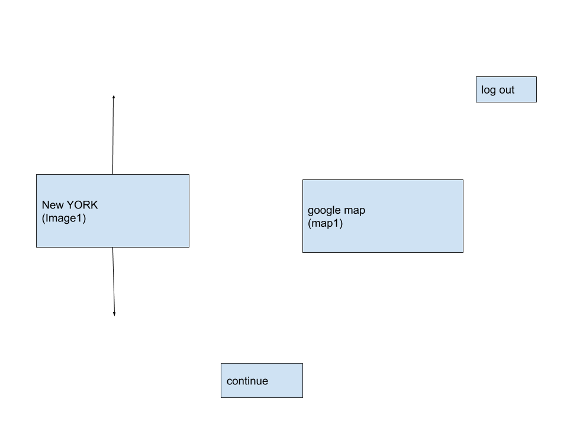
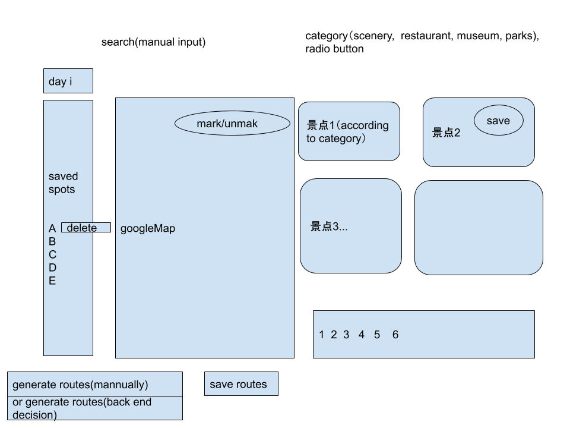

# Travel Plan Pegasus 
This is a design document for laioffer FLAG camp.
Contributor: Jie Ma

*This document follow the UC Berkeley CS 162 design document guide line*
[Documentation guideline] 
(https://people.eecs.berkeley.edu/~kubitron/courses/cs162-F06/design.html) 

JSON format for communication:
json for spots should be consistent with googlemapAPI
json for register/login should be consistent with Jupiter

### Part 0. Overview 
*Objective*
- This website provides 15 alpha cities travel plans.
- Users can create one city to make a day by day travel plans upto 15 days. 
- Users can select interest points for each city for different categories. 
- Users can order, delect the selected interest points. The website can generate travel plans by day based on the order of the selection. 
- The website can also autogenerate travel plans by day based on the selection set. 

*note*
All the bolded words refers one location on the website. 

*Definition of key words*
- interest points(景点): all the provided points regradless of the categories. 
- liked points:all the points user selected regardless of the categories.
- function: describe the function of the button/icon
- vistor: anyone visit the website without an account. 

### Part 1. Home Page （Jie Ma) 
Display as the diagram shows:

the Home Page serves three purposes: 
1. Allow visitor to select a city from the search bar and the website will jump to the login page 
2. Allow visitor to select a city from the image1, and the website will jump the login page 
3. Allow user who want to sign up to create an account. 
4. Allow users who have already signed up to log on. 

*TODO list the function, UI design ..... *
1. Search bar: 
2. image1:
3. Sign in: 
4. Sign up:
5. Sign out: 

### Part 2. Login/Logout Register (Jie Ma)  
1. Backend: 
2. Frontend:

### Part 3. Display interest points by category
Display as the diagram shows

Supported type: 
https://developers.google.com/places/supported_types 
1. Default popular spot

2. hotel 

3. shopping

4. restaurants

### Part 4. Select interest points (Jieyu You)
Each spot has a "save" button. On clicking the "save" button, the spot will be added to the "saved spots" list. This list contains the travel plan for one day, the user needs to use the drop-down list to switch to another day. Each entry in the "saved spots" list should contain a "delete" button to remove it from the list. One entry must be selected as the starting point for the travel.

requirements:

1. The "save spots" list for different day should be independent.
2. The order of spots in "saved spots" list should be the order of their addition.
3. A spot appear multiple times even on one day's list.
4. The list is saved only when "save routes" button is clicked.
  - if "generate routes(manually)" is selected, spots will be saved in the order of addition
  - if "generate routes(recommended)" is selected, spots will be saved according to the recommended order.
5. save routes only save the route of the current day.

### Part 5. Generate routes based on user's selection 
- Purpose:
  Generate a visual route on GoogleMap according to liked points list.
- Function :
  Generate routes (user-defined)
- Scenario :
  1. Get ordered liked points from liked points list
  2. Use Google Map API (frontend) to pin liked points in order and draw a route on Google Map
  3. Send liked points list to backend for storing if invoking save route function 
  4. Update liked points list
  5. 
	
### Part 6. Recommend routes based on user's selection (Jiahui Yang)
- Basic Version:
  show a shortest / random path of user's selection, connected with straight line.
- Advanced Version:
  generate the route by several features:
  1. traffic: avoid traffic for some route
  2. time and seasonal visiting frequency
  3. category: do not put the same category in the same day
  4. more features to be continued ...

## Milestones
phase 1: finish an available webapp demo

6.16-6.23   
6.24-6.30  

phase 2: advanced features like recommendation based on interests, frontend components

7.1-7.8    
7.9-7.15   

